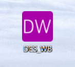
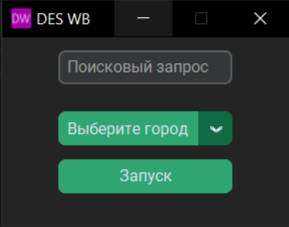
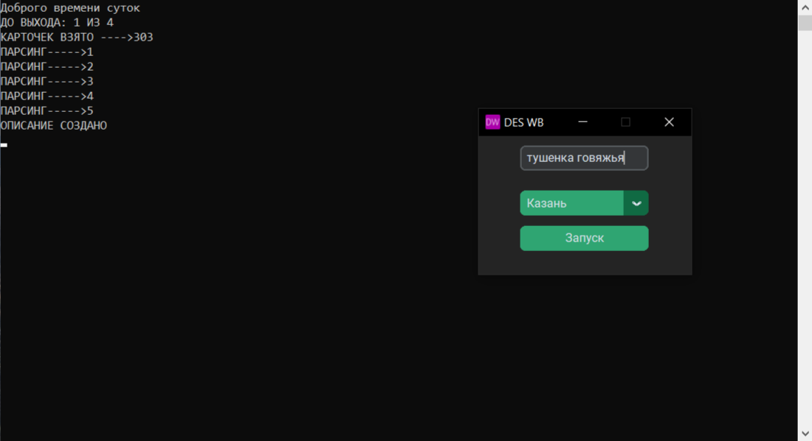
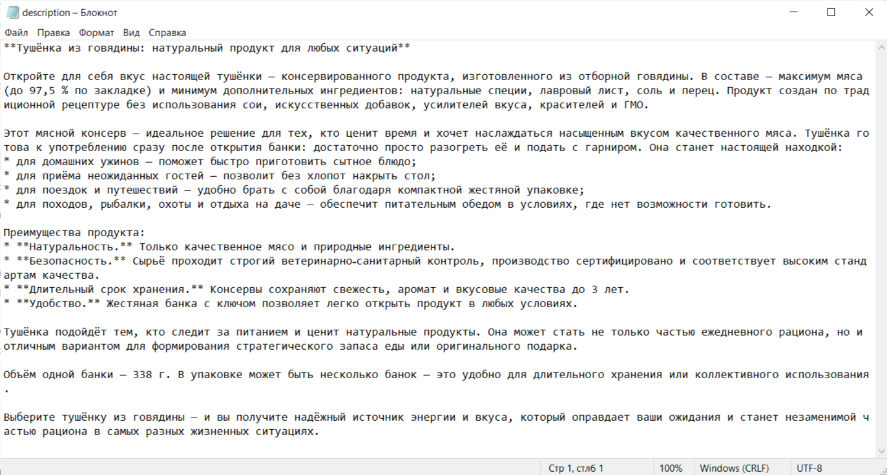
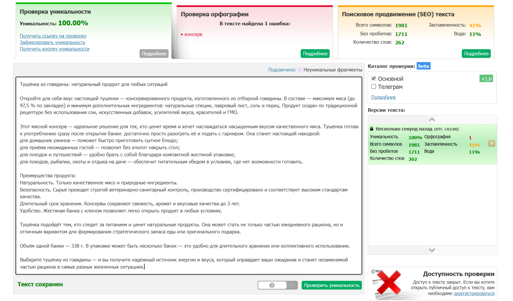

    

        <strong>Disclaimer:</strong> данный проект разработан исключительно в образовательных и демонстрационных целях как часть портфолио. Автор не несет ответственности за нецелевое использование скрипта или нарушение условий пользования сторонних ресурсов.
    

<h1 style='border-bottom: none; color: #F2E9E4'>wb description creator</h1>

<h2>Описание</h2> 

    Программа генерирует описание карточки товара, на основе взятых ключей у топ 5 карточек по количеству оценок покупателей.  Находит эти карточки по поисковому запросу пользователя и по выбранному городу. Сгенерированное описание выгружает в файл description.txt.

<h2>Стек</h2>
<ul>
    <li>Язык: Python 3.13.11</li>
    <li>Пользовательский интерфейс: Customtkinter</li>
    <li>Автоматизированный сбор данных с сайта: Playwright</li>
    <li>Парсинг собранной информации: BeautifulSoup</li>
    <li>Генерация описания: Yandex aliceai-llm</li>
    <li>Для идентификатора каталога и api ключа: dotenv</li>
    <li>Упаковка программы в один .exe файл: PyInstaller</li>
</ul>

<h2>Демонстрация программы</h2>

    

    

    

    

    

<h2>Установка</h2>

    

        <strong>Примечание:</strong> для работы программы вам понадобиться API ключ (API_KEY) и идентификатора каталога (FOLDER_ID). Получить их вы можете на сайте <a href='https://aistudio.yandex.ru/ru'>Яндекса</a>. После, их нужно вписать в соответствующие поля в файле <a href='.env.example'>.env</a>.
    

<ol>
    <li>Клонируйте репозиторий любым удобным способом. Если у вас установлен git, скопируйте в консоль <code>https://github.com/cjybxrf/wb-description-creator.git</code></li>
    <li>Запустите скрипт установки <code>start build.cmd</code></li>
    <li>Заполните файл <code>.env</code></li>
    <li>Запустите завершающий скрипт установки <code>final build.cmd</code></li>
</ol>

После установки файл DES_WB.exe будет лежать в папке dist. В процессе установки так же будут подсказки в консоли.
